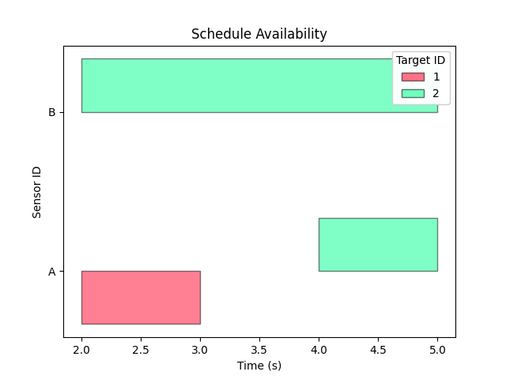
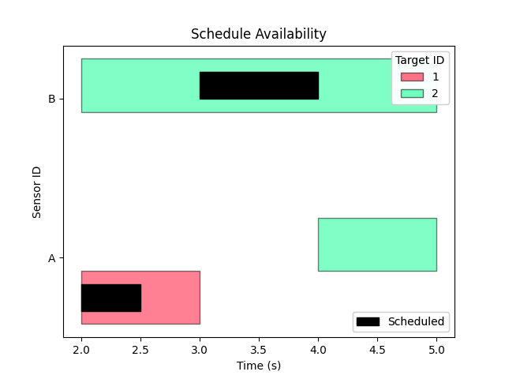

# **satvis**: A satellite visibility calculator.
## Description
*satvis* is a small library of functions used to calculate line-of-sight (LOS) visibility between spacecraft and plot access windows.
The core functions that the library is based on are implementations of algorithms developed by J. A. Lawton and Salvatore Alfano et. al. Visibility windows are represented as `IntervalTree`s.
Access windows are plotted using *matplotlib*.

## Install
```
pip install satvis
```

## Visibility Function Examples
The module `visibility_func.py` contains the basic building blocks of the module, including the visibility function algorithm developed by Lawton and Alfano.
Import the functions used in the following examples with:

```python
from visibility_func import visibilityFunc, isVis, zeroCrossingFit
```

### Example 1

To calculate the visibility between two Earth-centered-inertial (ECI) points:

```python
earth_radius = 6378 # km
extra_height = 0 # km
r1 = array([[earth_radius + 400, 0, 0]]).transpose() # position of object 1
r2 = array([[earth_radius, 0, 0]]).transpose() # position of object 2

[vis, phi, a1, a2] = visibilityFunc(r1, r2, earth_radius, extra_height)
print(vis)
print(phi)
print(a1)
print(a2)

# Prints:
# 0.3451182504723773
# 0.00014753614577624565
# 0.34526578661815355
# 0.0
```

where `vis` is the value of the visibility function, `phi` is the angle (in radians) drawn between the two Earth-centered-inertial points, and `a1` and `a2` are intermediate construction angles.
A value of `vis`>0 means that the two points have a direct LOS to each other.

### Example 2
If you just want to know if two points are visible to each other in a binary fashion, use `isVis`:

```python
[vis_bool] = isVis(r1, r2, earth_radius, extra_height)
print(vis_bool)
# True
```

### Example 3
A series of visibility function values can be represented as a couple of `ndarray`s or an `IntervalTree` via the `zeroCrossingFit` function.
This is handy if you want to calculate visibility windows between two objects.

```python
t = array([0, 1, 2, 3, 4]) # time vector
vis = array([-1, -0.1, 0.5, 4, 2]) # objects become visible to each other between t[1] and t[2]
[crossings, rise_set, vis_tree] = zeroCrossingFit(vis, t)
print(crossings)
print(rise_set)
print(vis_tree)

# Prints:
# [1.40896106] 
# [1.]
# tree=IntervalTree([Interval(1.4089610649024726, 4)])
```

where `crossings` is a list of times at which the visibility function value crosses zero, `rise_set` indicates the direction of the crossing (1=rise, -1=set), and `tree` is an `IntervalTree` indicating time windows during which the visibility function value is positive.
See [the IntervalTree package](https://github.com/chaimleib/intervaltree) on GitHub for details on its structure.

### Example 4
If the two objects never see each other, the returned arrays and `IntervalTree` are empty.

```python
vis = array([-1, -0.1, -0.5, -4, -2]) 
[crossings, rise_set, vis_tree] = zeroCrossingFit(vis, t)
print(crossings)
print(rise_set)
print(vis_tree)
# Prints:
# []
# []
# IntervalTree()
```

### Example 5
You can assign an identifier to `Interval`s within an `IntervalTree`.
This is useful if you combine multiple `IntervalTree`s representing more than two objects.

```python
vis1 = array([-1, -0.1, 0.5, 4, 2])
vis2 = array([-2, -1, -0.5, 1, 1.1]) 
[_, _, vis_tree1] = zeroCrossingFit(vis1, t, "pair1")
[_, _, vis_tree2] = zeroCrossingFit(vis2, t, "pair2")
combined_tree = vis_tree1 | vis_tree2
print(vis_tree1)
print(vis_tree2)
print(combined_tree)
# Prints:
# tree=IntervalTree([Interval(1.4089610649024726, 4, 'pair1)])
# tree=IntervalTree([Interval(2.328702338492417, 4, 'pair2')])
# IntervalTree([Interval(1.4089610649024726, 4, 'pair1'), Interval(2.328702338492417, 4, 'pair2')])

```

## Visibility History Examples
The `vis_history.py` module contains functions to calculate the visibility function value as a time history for multiple sensors and targets. 
The functions in these examples can be imported with:

```python
from vis_history import getVisHist
```

### Example 1
To get an `IntervalTree` and `ndarray` of the visibility history between a single sensor and target, define the target and sensor ids, their state histories, a time vector, and the radius of the planetoid.

```python
RE = 6371  # Earth radius, km
time = [0, 1, 2, 3]  # units don't matter

# Having the ids in lists may seem redundant for now, but will make sene in later examples
target_id = [{"id": "T1"}]
sensor_id = [{"id": "S1"}]

# The third dimension is trivial in this example, but will be expanded in later examples
states_target = zeros([len(time), 6, 1])  # (T, 6, 1) array, ECI frame
states_sensor = zeros([len(time), 6, 1])  # (T, 6, 1) array, ECI frame

# The sensor and target are moving in the +I direction over time, with the sensor always being further away from the Earth
states_target[:, 0, 0] = array([8000, 9000, 10000, 11000]) # km
states_sensor[:, 0, 0] = 1.1 * array([8000, 9000, 10000, 11000])  # km

tree, vis = getVisHist(
    targets=target_id,
    sensors=sensor_id,
    x_targets=states_target,
    x_sensors=states_sensor,
    time=time,
    planet_radius=RE,
)
print(tree)
print(vis)
# Prints:
# IntervalTree([Interval(0, 3, {'target_id': 'T1', 'sensor_id': 'S1'})])
# [[[1.41076435 1.6559796  1.83313801 1.96935546]]]
```

Note that the 2nd dimension of the sensor and target states is 6.
The first 3 elements of this dimension are position, the last 3 elements are velocity, both in the ECI frame.
Velocity is irrelevant for the calculation, but we leave it in the argument to be consistent with the definition of a *state vector* in orbital dynamics.
Also note that the dimensions of both the states and time array are arbitrary.
As long as you are consistent and the states are in the ECI frame, units don't matter.

Also note that the target and sensor ids are just items in `dict`s; you can have other entries in the target/sensor `dict`s, just as long as one of the keys is `"id"`.

How to interpret these outputs?
- `tree (IntervalTree)`: In the interval from 0-3 along `time`, target `T1` and sensor `S1` can see each other.
- `vis (ndarray)`: The value of the visibility function is increasing over time, and is greater than 0 the entire length of `time`.


### Example 2
Now for a more interesting example.
This time we have 2 sensors and 3 targets.

```python
# time vector
time = [0, 1, 2, 3]
# create dummy target/sensor dicts
sensor_dicts = [
    {"id": "A"},  # ids can be `str`...
    {"id": "B"},
]
target_dicts = [
    {"id": 1},  # ... or any format.
    {"id": 2},
    {"id": 3},
]
# create dummy state history
states_targets = zeros([len(t1), 6, 3])
states_sensors = zeros([len(t1), 6, 2])

# Build state histories for the following:
# Visible to each other:
#   # Target 1 / Sensor A
#   # Target 2 / Sensor B
#   # Target 3 / Sensor B
# Not visible to each other:
#   # Target 1 / Sensor B
#   # Target 2 / Sensor A
#   # Target 3 / Sensor A

# Positions must be greater than Earth radius to get through
# visibilityFunc error check. Velocities aren't used so set to zero.
states_targets[:, 0, 0] = array([8000, 9000, 10000, 11000])
states_targets[:, 0, 1] = -1 * array([8000, 9000, 10000, 11000])
states_targets[:, 0, 2] = -1 * array([8000, 9000, 10000, 11000])

states_sensors[:, 0, 0] = 1.1 * array([8000, 9000, 10000, 11000])
states_sensors[:, 0, 1] = -1.1 * array([8000, 9000, 10000, 11000])

tree, vis = getVisHist(
    targets=target_dicts,
    sensors=sensor_dicts,
    x_targets=states_targets,
    x_sensors=states_sensors,
    time=time,
    planet_radius=RE,
)
print(f"tree ={tree})
print(f"vis = {vis})
# Prints:
# tree = IntervalTree([Interval(0, 3, {'target_id': 3, 'sensor_id': 'B'}), Interval(0, 3, {'target_id': 1, 'sensor_id': 'A'}), Interval(0, 3, {'target_id': 2, 'sensor_id': 'B'})])
# vis = 
# [[[ 1.41076435  1.6559796   1.83313801  1.96935546]
#   [-1.7308283  -1.48561305 -1.30845464 -1.17223719]
#   [-1.7308283  -1.48561305 -1.30845464 -1.17223719]]
# 
#  [[-1.7308283  -1.48561305 -1.30845464 -1.17223719]
#   [ 1.41076435  1.6559796   1.83313801  1.96935546]
#   [ 1.41076435  1.6559796   1.83313801  1.96935546]]]
```

Before we examine the outputs, note the format of sensor/target id.
Note that the value of "id" can be any format; here we are using `str`s and `int`s, but you can use anything.

Now onto the outputs.
First let's look at `tree`:
- Target `3`/sensor `B`, target `1`/sensor `A`, and target `2`/sensor `B` can see each other from 0-3.
- There are no `Interval`s in the `IntervalTree` for target `1`/sensor `B`, target `2`/sensor `A`, or target `3`/sensor `A`; none of these target/sensor pairs can see each other over `time`.
- Note that the order of `Interval`s in `tree` are not time-ordered; this is because `IntervalTree`s do *not* preserve order.
- The order of arrays in `vis` corresponds to the order of inputs in `targets` and `sensors`.

Now we examine `vis`:
- The output `vis` array is (M, N, T), where M is the number of sensors, N is the number of targets, and T is the length of the time array.
- Looking at the upper 3x4 array block, we see that all the entries in row 0 (1.41, 1.65, ...) are positive.
This corresponds to target `1`/sensor `A` being visible to each other.
- Conversely, all of the entries in row 1 of the upper block (-1.73, -1.48, ...) are negative.
This corresponds to target `2`/sensor `A` ***not*** being visible to each other.
- The lower array block corresponds to sensor `B`.

## Schedule Plots Examples
Access windows between sensors and targets can be plotted using `plotSchedule`.
Import the functions used in the following examples with:

```python
# local imports
from schedule_plots import plotSchedule
from int_tree_converter import intTree2WindowList

# 3rd-party imports
from intervaltree import Interval, IntervalTree
```

### Example 1
`plotSchedule` requires a specifically-formatted `ndarray` that is not easily human-readable.
To convert from the easyish-to-read output of `getVisHist` to something that `plotSchedule` can interpret, we use the converter function `intTree2WindowList`. 

```python
# Build a simple IntervalTree
tree = IntervalTree([Interval(0, 3, {'target_id': 3, 'sensor_id': 'B'}), Interval(0, 3, {'target_id': 1, 'sensor_id': 'A'}), Interval(0, 3, {'target_id': 2, 'sensor_id': 'B'})])

# Convert IntervalTree
[windows, sensor_ids, target_ids] = intTree2WindowList(schedule_tree=tree)
print(windows)
print(sensor_ids)
print(target_ids)
# Prints:
# [[[(0, 3)], [], []], [[], [(0, 3)], [(0, 3)]]]
# ['A', 'B']
# [1, 2, 3]
```

The sensor and target ids are used for debugging, and generally ignored when using `intTree2WindowList`.
`windows` is formatted such that `plotSchedule` can accept it as an argument.

### Example 2: Basic Plot
Now to generate a schedule plot. 
Before calling `plotSchedule`, create a *matplotlib* figure, which is passed in as an argument.

```python
f = plt.figure()
avail = [
            [[(2, 1)], [(4, 1)]],  # access windows for Sensor A
            [[], [(2, 3)]]  #  access windows for Sensor B
        ]
target_labels = ['1', '2']
sensor_labels = ['A', 'B']
f = plotSchedule(
    availability=avail,
    target_labels=target_labels,
    sensor_labels=sensor_labels,
    fig=f
    )
plt.show()
```

The above code outputs this figure:


### Example 3: Scheduled Plot
There are optional arguments to `plotSchedule` that show a "scheduled" sensor-target pairs as well as availability.

```python
f = plt.figure()
avail = [
            [[(2, 1)], [(4, 1)]],  # access windows for Sensor A
            [[], [(2, 3)]]  #  access windows for Sensor B
        ]
sched = [
            [[(2, 0.5)], []],  # schedule for Sensor A
            [[], [(3, 1)]], #  schedule for Sensor B
        ]  
target_labels = ['1', '2']
sensor_labels = ['A', 'B']
f = plotSchedule(
    availability=avail,
    target_labels=target_labels,
    sensor_labels=sensor_labels,
    fig=f,
    scheduled=sched,
    scheduled_targ_labels=target_labels,
    scheduled_sensor_labels=sensor_labels,
    )
plt.show()
```

The above code outputs this figure:


## Citations:
- Alfano, Salvatore & Jr, Negron, & Moore, Jennifer. (1992). Rapid Determination of Satellite Visibility Periods. Journal of The Astronautical Sciences. Vol. 40, April-June, pp 281-296. 
- Lawton, J. A.. (1987). Numerical Method for Rapidly Determining Satellite-Satellite and Satellite-Ground Station In-View Periods. Journal of Guidance, Navigation and Control. Vol. 10, January-February, pp. 32-36
- Chaim Leib Halbert's IntervalTree package on GitHub, https://pypi.org/project/intervaltree/#description

